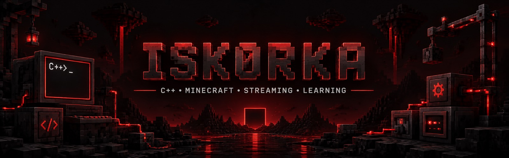

<!--
  Profile README for github.com/isk0rka
  Update the checkboxes as you learn. Keep claims honest and link finished work.
-->

<div align="center">



<br />

<a href="https://github.com/isk0rka">
  
</a>


### Student by day · Minecraft creator by night

I turn university practice into real projects and keep this profile as a public development notebook.

</div>

---

## About Me

```cpp
struct Isk0rka {
    const char* name = "Andrey";
    const char* main_language = "C++ (actively learning)";
    const char* main_game = "Minecraft";
    const char* interests = "automation, modding, streams, videos";
    bool student = true;
    bool always_learning = true;
};
```

- Studying programming at university and keeping coursework organized here.
- Learning C++ through console applications, business logic, validation, file storage and tests.
- Playing, streaming and making videos about Minecraft.
- Exploring ComputerCraft, in-game automation and the path toward Minecraft modding.
- Building in public: the checklists below are a learning log, not a claim of expertise.

---

## Development Notebook

This README is my public notebook. I use three simple states:

| State | Meaning |
|:--|:--|
| ✅ Used in practice | I have applied it in code and can return to it independently. |
| 🔴 Learning now | I am studying or practising it in current projects. |
| ⬜ Planned | It is on the roadmap, but I am not claiming it as a current skill. |

### Current Learning

| Area | Current focus | Status |
|:--|:--|:--:|
| **C++** | STL, program structure, clean interfaces, testing | 🔴 Learning now |
| **Software design** | Splitting UI, logic, storage and utilities into clear layers | 🔴 Learning now |
| **Minecraft automation** | ComputerCraft concepts and useful in-game systems | 🔴 Exploring |
| **Content creation** | Streams, videos and a consistent Minecraft-focused identity | 🔴 In progress |

### Learned / Comfortable

> These are foundations already used in practice; I am still improving them.

- ✅ C++ syntax, functions, structures and multi-file programs
- ✅ Console input/output and validation
- ✅ Basic file-based persistence
- ✅ Separating a project into UI, logic, storage and core utilities
- ✅ Writing focused checks for program logic
- ✅ Basic Git and GitHub workflow for publishing study projects

### Planned

- ⬜ Modern C++ in greater depth: RAII, smart pointers, templates and algorithms
- ⬜ CMake and a repeatable build workflow
- ⬜ Automated testing and GitHub Actions
- ⬜ Java fundamentals for Minecraft modding
- ⬜ Fabric or NeoForge mod development
- ⬜ Lua fundamentals and the ComputerCraft API
- ⬜ Minecraft utilities, stream tools and creator-side automation

---

## Roadmaps

<details open>
<summary><strong>C++ Roadmap</strong></summary>

### Foundations

- [x] Variables, conditions and loops
- [x] Functions, structures and multi-file projects
- [x] Console input/output and validation
- [x] File input/output in a practice project
- [ ] References, pointers and memory model — deepen understanding
- [ ] Object-oriented design — practise deliberately

### Modern C++

- [ ] Standard library containers and iterators
- [ ] Algorithms and lambdas
- [ ] RAII and resource ownership
- [ ] Smart pointers
- [ ] Exceptions and error-handling strategies
- [ ] Templates and generic programming
- [ ] Move semantics and value categories

### Project Engineering

- [x] Separate UI, business logic and storage in a project
- [x] Add focused logic tests to a project
- [ ] CMake
- [ ] Unit-testing framework
- [ ] Formatting, static analysis and sanitizers
- [ ] GitHub Actions for automatic builds and tests
- [ ] Ship a polished C++ application with documentation

</details>

<details>
<summary><strong>Java / Minecraft Modding Roadmap</strong></summary>

- [ ] Java syntax and standard library fundamentals
- [ ] Classes, interfaces, inheritance and composition
- [ ] Collections, generics and exceptions
- [ ] Gradle basics
- [ ] Understand Minecraft client/server architecture
- [ ] Choose and set up Fabric or NeoForge
- [ ] Create a first item and block
- [ ] Add recipes, tags and data generation
- [ ] Learn events, networking and saved data
- [ ] Build a small original quality-of-life mod
- [ ] Publish documentation and releases on GitHub

</details>

<details>
<summary><strong>Lua / ComputerCraft Roadmap</strong></summary>

- [ ] Lua syntax, tables, functions and modules
- [ ] Files, serialization and error handling
- [ ] ComputerCraft terminal and filesystem APIs
- [ ] Turtle movement, inventory and fuel management
- [ ] Rednet communication and protocols
- [ ] Monitors, peripherals and event handling
- [ ] Write a reusable turtle navigation module
- [ ] Build a mining or farming automation project
- [ ] Create an in-game monitoring dashboard
- [ ] Document setup, screenshots and usage on GitHub

</details>

---

## Projects

<table>
<tr>
<td width="50%" valign="top">

### [Console Calendar App](https://github.com/isk0rka/console_calendar_app_to_practice)

A C++ console calendar with events and reminders, developed as a practice project for business logic, modular design, validation, file storage and tests.

`C++` `Console` `Layered structure` `Practice`

</td>
<td width="50%" valign="top">

### [Development Notebook](https://github.com/isk0rka/isk0rka)

This profile repository: an honest, version-controlled map of what I use, what I am learning and what I want to build next.

`Learning log` `Roadmaps` `GitHub profile`

</td>
</tr>
<tr>
<td width="50%" valign="top">

### Minecraft Automation Project

Planned: a documented ComputerCraft project for a useful in-game automation task.

`Lua — planned` `ComputerCraft — planned`

</td>
<td width="50%" valign="top">

### First Minecraft Mod

Planned: a small original quality-of-life mod built while learning Java and a modern mod loader.

`Java — planned` `Modding — planned`

</td>
</tr>
</table>

---

## Minecraft / Content Creation

Minecraft is the main theme behind my streams, videos and future side projects.

```text
play → notice a repetitive task → automate it → explain the result → improve it
```

Areas I want to connect with development:

- ComputerCraft programs and turtle automation
- small quality-of-life mods and utilities
- tools that support streams and video production
- clear project write-ups that can become useful video material

<!-- Add verified channel links here when ready. Example:
<a href="YOUR_YOUTUBE_URL"></a>
<a href="YOUR_STREAM_URL"></a>
-->

---

## Tech Stack

### Using and practising

<p>
  
  
  
  
</p>

### On the roadmap

<p>
  
  
  
  
</p>

<sub>Roadmap icons show future study areas, not current proficiency.</sub>

---

## GitHub Stats

<div align="center">

<a href="https://github.com/isk0rka?tab=repositories">
  
</a>
<a href="https://github.com/isk0rka?tab=followers">
  
</a>
<a href="https://github.com/isk0rka?tab=repositories&amp;q=&amp;type=&amp;language=c%2B%2B&amp;sort=">
  
</a>

[View repositories](https://github.com/isk0rka?tab=repositories) · [View contribution activity](https://github.com/isk0rka)

<sub>These links use GitHub's own profile data; skill level is described in the notebook above.</sub>

</div>

---

## Contacts

<div align="center">

<a href="https://github.com/isk0rka">
  
</a>

For project questions, ideas or collaboration, open an issue in the relevant repository.

<!-- Add only verified public contacts. Do not publish a private email address. -->

`learning in public • one project at a time`

</div>
